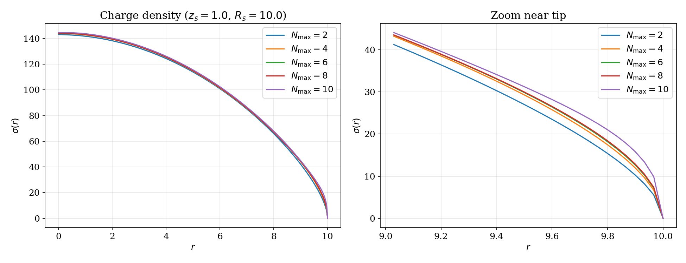
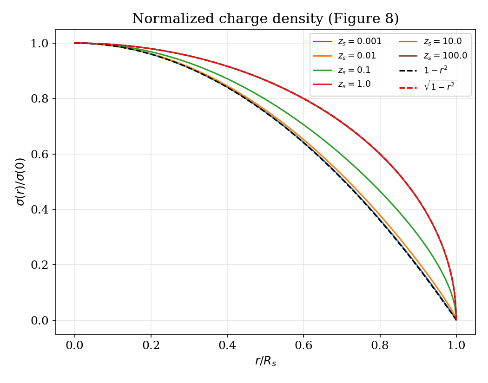
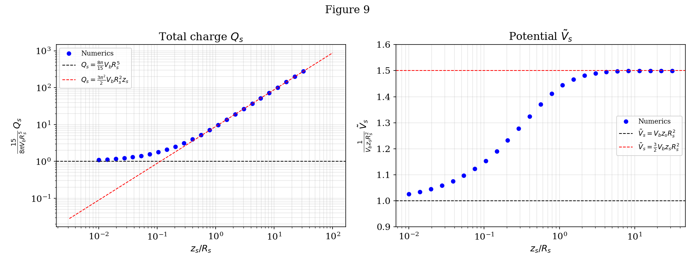
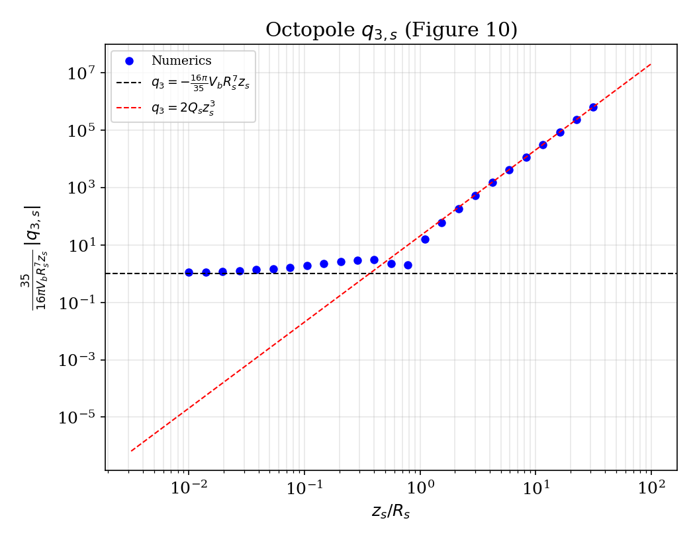

# Electrostatic_Polarized_IKKT

Numerical solver for a 4D electrostatic boundary value problem. This code was used to produce some plots in the physics paper ([Einstein gravity from a matrix integral](https://arxiv.org/abs/2411.18678), appendix D).

## The problem

Find the charge density $\sigma(r)$ on a conducting ball such that the total electrostatic potential (ball + image + background) is constant on the conductor. This reduces to solving a singular integral equation where the kernel has a logarithmic singularity.

## The approach

1. **Basis expansion** — Expand $\sigma(r)$ in shifted Legendre polynomials plus a square-root tip correction that captures the expected edge behavior.
2. **Precompute a potential matrix** — For each basis function and each grid point, numerically evaluate the singular integral using adaptive quadrature (`scipy.integrate.quad` with singularity hints). This is the expensive step, done once.
3. **Solve via least squares** — The boundary value problem is linear in the unknown coefficients. Together with boundary conditions, it forms an overdetermined system solved exactly with `numpy.linalg.lstsq`. No iterative optimization needed.

The key insight is that although the *constraint* (sum of squared residuals) is quadratic, each individual equation is *linear* in the unknowns — so the problem is a standard linear least-squares fit, not a nonlinear optimization.

## How to run

### Prerequisites

Python 3, NumPy, SciPy, Matplotlib.

### Usage

Generate all figures:

```
python3 plots.py
```

Or use the solver as a library:

```python
from charge_density import charge_density

sigma = charge_density(Rs=1.0, zs=1.0, Nmax=4)
sigma.minimize()

print(sigma.Vs)              # potential on the conductor
print(sigma.total_charge())  # total charge
print(sigma(0.5))            # evaluate charge density at r = 0.5
```

### Repository structure

```
├── charge_density.py  # Solver: basis expansion, potential matrix, least-squares solve
├── plots.py           # Reproduces figures 7–10 of the paper
├── charge_density.nb  # Original Mathematica notebook (requires Wolfram license)
└── README.md
```

## Results

Convergence is fast — 6 basis functions ($N_{\max} = 4$) are enough for full accuracy:



The solver reproduces all analytic limits and interpolates smoothly between them:







## Reference

This code supports the numerics in appendix D of:

> S. Komatsu, A. Martina, J. Penedones, A. Vuignier, X. Zhao,
> *Einstein gravity from a matrix integral — Part II*,
> [arXiv:2411.18678](https://arxiv.org/abs/2411.18678)

```bibtex
@article{Komatsu:2024pii,
    title     = {Einstein gravity from a matrix integral -- {Part II}},
    author    = {Komatsu, Shota and Martina, Adrien and Penedones, Jo\~ao 
                 and Vuignier, Antoine and Zhao, Xiang},
    eprint    = {2411.18678},
    archivePrefix = {arXiv},
    primaryClass  = {hep-th},
    year      = {2024}
}
```
